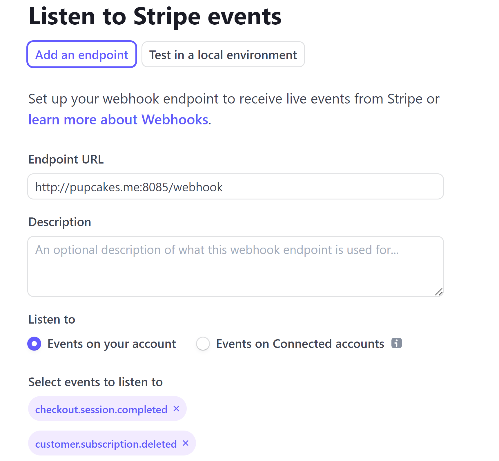

# Gasless
A transaction relayer SaaS for interacting with the Lukso blockchain without the need for gas. Users can purchase a subscription to gain access to a monthly usage quota.

## Info
Project Name: Gasless Relayer 

Team: Fluffy9 

Email: gasless@pupcakes.me


## Video

[Dashboard Overview](https://youtu.be/tQKNo_3pGRU)

[Technical Overview](https://youtu.be/Y5tbtKfiHtQ)

## Demos
* Landing: [Source](https://github.com/Fluffy9/Gasless-Landing) | [Demo](http://pupcakes.me:8082)
* App: [Source](https://github.com/Fluffy9/Gasless-App) | [Demo](http://pupcakes.me:8083)
* Contracts: [Source](https://github.com/Fluffy9/Gasless-Contracts) | [GasLimiter](https://explorer.execution.l16.lukso.network/address/0xE16F81f76df4584D2Fb4313727e24612453e7156) | [GasLimiterFree](https://explorer.execution.l16.lukso.network/address/0x8c5767a4D24E22208D9583aB02eE60a1bdCb0c3D)
* Runner: [Source](https://github.com/Fluffy9/Gasless-Runner) | [Free](http://pupcakes.me:8084) | [Basic](http://pupcakes.me:8085)

## Organization of Code
There are 3 applications that make up the Gasless Saas. The landing page, the web app, and the runner. They can be run together using `docker-compose` to deploy the entire project or they can be run individually for testing/development. Each application has a .env file that will be used when run individually. When run together, the `docker-compose.yml` pulls from the root .env file for default values. The variables defined within the `docker-compose.yml` environment section override the ones from the file. For someone who simply wants to deploy the entire project, modifying the variables in the `docker-compose.yml` is enough. For doing development on an individual application, you will need to add your variables into its .env file  

## Project Architecture


GasLimiter.sol
* Proxies executeRelayCall()
* Keeps track of gas spent by the user
* Keeps track of user's quota vs time period
* Hard cap on gas usage
* Will revert if anything goes wrong
* Only whitelisted addresses can execute transactions on behalf of users
* The owner can add and remove users
* Events are logged for easy transaction history

GasLimiterFree.sol
* Proxies executeRelayCall()
* Keeps track of gas spent by the user
* Keeps track of user's quota vs time period
* Hard cap on gas usage
* Will revert if anything goes wrong
* Only whitelisted addresses can execute transactions on behalf of users
* Users cannot be removed
* New users are added automatically the first time a transaction is executed for them
* Events are logged for easy transaction history


Runner
* Handles transactions for a specific plan contract they are whitelisted for
* Accepts stripe webhooks.
* Add new paying users to its contract
* Remove users who unsubscribe
* Forwards all /execute transactions to the contract
* Only sends the transaction if it doesn't revert
* When given multiple wallets, it will choose one that has enough funds and is least recently used
* Returns the plan quota set from the environment (soft cap)

App
* Shows plan details, usage, limits, and past transactions
* Handles Stripe checkout
* Allows users to cancel their subscription
* Quick endpoint tests

Landing Page
* Shows price details
* Shows general service information
* Links to App
## Potential Future Developments
A few ideas of how development on this project may continue:

### Partnership with Wallets
As of now, you need to already have an UP to login and use the API endpoints. When a user-friendly wallet service is available, it would be a great opportunity for a partnership. A new endpoint could be added to Gasless simply to create a new UP. The partnering wallet could use that to create free UP for users without them having to interact with the blockchain at all. Gasless would then use this wallet service as the login point for the user dashboard.

### Subgraph Support
When subgraph access is available that would greatly enhance the performance of the transaction list.

### User Run Runner Bots
Instead of using a whitelist, we could drop the burden of managing runner bots entirely by creating an incentive for external users to run their own (MEV opportunity). A user-run bot would listen to /execute transactions and send these to the appropriate contract. Using the logs created from this, we can refund the gas they spent and also add a small reward. This would eliminate tracking wallet balances, infrastructure load, and it would be very fast, as there is now competition to get the transaction relayed

It would require a little bit of work to ensure there is no unfair play possible by removing the whitelist. It would also likely mean separating out the Stripe webhooks from the runner bot to avoid leaking private data.

### DAO Owned Software / Licensing
Due to the customizable nature of Gasless, it could be a good base for other relayer services to build off of. This could be done with some form of paid licensing structure. The core software could be DAO owned and run. This separates the burden of building and managing customers to: 
* Using a DAO to build and manage the software development
* Having 3rd parties who focus on customer acquisition and management

### Usage-based quota / share quota (Paid plans only)
While a fixed price is easier for users to understand (prevents overspending) and easier to implement, users could get more benefit from their paid plans with further options. Usage-based billing would allow power users to make more transactions than currently offered. Sharing quota could bring in new customers and could be easily implemented into the smart contract without Stripe modifications. 

## Considerations
Miscellaneous explanations
### Hard Cap vs Soft Cap
The GasLimiter and GasLimiterFree contracts will immediately revert if a user has used more gas than they have available for the current period. This is a hard cap. Gasless displays a set number for the user's quota and this may not match what the contract limit is. It can be more user-friendly to have a lower number in the UI but higher number in the contract. This means a user is more likely to stop sending transactions before getting a revert error message.

Both the UI and the API will return numbers set through the environment variables. These may or may not be the same as the actual contract limit. If you don't want to have a soft cap, ensure that the `VUE_APP_PLAN_X_QUOTA` variables are set to the same number as the contract's `_limit` constructor argument

### Scaling / Addressing Failure
This application is built to be simple but scale to serve many times more users with simple changes in settings. The `docker-compose.yml` file sets up two runners by default. One to serve the Basic Plan and one to serve the Free Plan. You can easily copy the configuration to have more runners. In this case, it would be ideal to have Nginx, or some other load balancer strategy set up. In the case where the bottleneck is the number of wallets the runner has, that is easily fixed by adding more to the environment variables (Remember to whitelist the new bots on the contract or it'll fail!).

If a service fails for whatever reason (landing, app, runners) the current policy is to try and restart it twice. This can also be modified in the `docker-compose.yml`

If the only runner is down while a user makes a purchase/cancels a subscription, it shouldn't be much of a problem. It will restart, and Stripe re-sends webhook events over certain intervals when it doesn't get a response. 

If the only runner is down while a user is making a transaction, they will just need to wait until it restarts and re-send it. 

## Deployment
### Set up a domain name or DDNS name
You need a domain name or DDNS name for Stripe to send event data to. There are too many out-of-scope factors for us to discuss here. Just ensure you can SSH into your server with the domain/DDNS and without relying on its IP address and you're probably good
### Setup a Stripe Test Account
1. Create an account with [Stripe](https://dashboard.stripe.com/login)

2. [Create a payment link](https://dashboard.stripe.com/payment-links) called Basic Plan. It should cost 15 dollars and the billing period should be monthly. This will be put in the root .env file later


3. [Configure the User Portal](https://dashboard.stripe.com/test/settings/billing/portal) The default settings are fine. 

4. [Add a Webhook](https://dashboard.stripe.com/test/webhooks). This should point to the Basic Plan runner at /webhook. You need to use your custom domain/DDNS name here. Ensure it is set to listen to the `checkout.session.completed` event and the `customer.subscription.deleted` event


5. Find your Endpoint Secret. Under the new webhook you've created you'll see a signing secret which starts with `whsec_`. You will need to put that in the root .env file later


5. Find your API key on your [dashboard](https://dashboard.stripe.com/dashboard). It should start with `sk_test_`


### Deploy the contracts
You'll find the source code needed in [this repo](https://github.com/Fluffy9/Gasless-Contracts)
1. Copy the code of GasLimiterFree.sol into [Remix](https://remix.ethereum.org). 

2. Compile it. For constructor arguments, set `10000000000000000`(0.01 LYXe) and `Free` and deploy it using your MetaMask wallet containing enough funds to cover gas.

3. On your newly deployed contract, set the wallet address you've used as whitelisted. 


4. Repeat steps 1-3 but copy the GasLimiter.sol contract, use `1000000000000000000`(1 LYXe) and `Basic` as constructor arguments, and set the wallet address you've used as whitelisted.

### Deploy the Landing/App/Runners
Git clone this repository. Modify the docker-compose.yml file in the root with the variables we've set up in the previous steps


```
git clone https://github.com/Fluffy9/Gasless .
```

Specifically: 
* `VUE_APP_PLAN_1_CHECKOUT_URL` should be your stripe payment link
* `STRIPE` should be your stripe API key
* `ENDPOINT_SECRET` should be your endpoint secret starting with `whsec`
* `VUE_APP_PLAN_0_LIMITER` in all instances should be the address of the `GasLimiterFree.sol` that you deployed
* `VUE_APP_PLAN_1_LIMITER` in all instances should be the address of the `GasLimiter.sol` that you deployed
* `OWNER` should be the private key of the wallet you used to deploy `GasLimiterFree.sol` and `GasLimiter.sol`
* `WALLET_0` in all instances should be the same as `OWNER` in this case

Git clone Landing, App and Runner repositories in subdirectories
```
git clone https://github.com/Fluffy9/Gasless-Landing ./landing
```
```
git clone https://github.com/Fluffy9/Gasless-App ./app
```
```
git clone https://github.com/Fluffy9/Gasless-Runner ./runner
```
Your directory structure should look like this
```
.
└── Gasless/
    ├── app
    ├── landing
    └── runner
```

Build and deploy
```
docker-compose up --build
```
When the containers are all up and running:
* The landing page should be running at http://localhost:8082 and http://yourdomain.com:8082, 
* The app should be running at http://localhost:8083 and http://yourdomain.com:8083
* The free runner should be running at http://localhost:8084 and http://yourdomain.com:8084
* The basic runner should be running at http://localhost:8085 and http://yourdomain.com:8085

Stop/Destroy
```
docker-compose down
```

## Warning
Don't push images you build to public hosts like Docker Hub. This will compromise your private keys!
